	
	 
	<strong>Smarter Systems. Smarter Decisions.</strong>

# BizTalk DTA Backup to Azure Blob - Installation Workflow

## Visual Installation Process

```mermaid
flowchart TD
    A[📋 Start Installation] --> B{BizTalk Server<br/>Already Installed?}
    
    B -->|No| C[🔧 Install BizTalk Server 2020<br/>Complete Installation]
    B -->|Yes| D[📁 Locate Schema Directory]
    
    C --> D
    
    D --> E[📂 Navigate to Schema Directory<br/>C:\Program Files\Microsoft BizTalk Server 2020\Schema]
    
    E --> F[💾 Backup Existing Schema Directory<br/>Create backup copy]
    
    F --> G[📥 Download BizTalkBackupDTAToBlob Repository<br/>From GitHub: Phidiax/BizTalkBackupDTAToBlob]
    
    G --> H[🔍 Verify File Integrity<br/>Check SHA256 checksums]
    
    H --> I{Files Valid?}
    I -->|No| J[❌ Stop - Invalid Files<br/>Re-download or contact support]
    I -->|Yes| K[📋 Copy Scripts from BTS2020WithBlob<br/>Copy to Schema directory]
    
    K --> L[⚠️ Do NOT copy ClassicBTS2020<br/>Reference only]
    
    L --> M[☁️ Configure Azure Storage Account<br/>Get storage account name and key]
    
    M --> N[🔑 Create SQL Named Credential<br/>CREATE CREDENTIAL with Azure storage info]
    
    N --> O[🧪 Test SQL Credential<br/>Verify connection to Azure Blob]
    
    O --> P{Credential Test<br/>Successful?}
    P -->|No| Q[🔧 Troubleshoot Credential<br/>Check storage account details]
    P -->|Yes| R[⚙️ Run BizTalk Configuration Wizard<br/>Install updated stored procedures]
    
    Q --> N
    
    R --> S[🔄 Configuration Wizard Processes<br/>dtasp_PurgeTrackingDatabase_BLOB.sql]
    
    S --> T[📦 Auto-backup Original Procedure<br/>Creates dtasp_PurgeTrackingDatabase_ORG]
    
    T --> U[✨ Install New Procedure<br/>Install as dtasp_PurgeTrackingDatabase]
    
    U --> V[🔐 Grant Permissions<br/>Apply necessary database permissions]
    
    V --> W[🧪 Test DTA Backup<br/>Run test backup to Azure Blob]
    
    W --> X{Backup Test<br/>Successful?}
    X -->|No| Y[🔧 Troubleshoot Backup<br/>Check logs and configuration]
    X -->|Yes| Z[✅ Installation Complete<br/>DTA database can backup to Azure Blob]
    
    Y --> W
    
    Z --> AA[📚 Document Configuration<br/>Record credential names and settings]
    
    AA --> BB[🎉 Ready for Production<br/>BizTalk DTA Azure Blob backup enabled]

    style A fill:#e1f5fe
    style BB fill:#c8e6c9
    style J fill:#ffcdd2
    style Y fill:#fff3e0
    style Z fill:#c8e6c9
```

## Process Overview

### Phase 1: Prerequisites & Setup
- **BizTalk Server Installation**: Ensure BizTalk Server 2020 is installed
- **Schema Directory Access**: Locate and backup the schema directory
- **File Download & Verification**: Download and verify integrity of installation files

### Phase 2: Script Installation  
- **File Copying**: Copy updated scripts from `BTS2020WithBlob` folder
- **Automatic Backup**: Scripts automatically backup original procedures
- **Permission Management**: New procedures receive proper database permissions

### Phase 3: Azure Configuration
- **Storage Account Setup**: Configure Azure Blob Storage account
- **SQL Credential Creation**: Create named credential for secure Azure access  
- **Connection Testing**: Verify SQL Server can connect to Azure Blob Storage

### Phase 4: BizTalk Configuration
- **Configuration Wizard**: Run BizTalk configuration to install updated procedures
- **Procedure Installation**: Install `dtasp_PurgeTrackingDatabase` with Blob support
- **Testing & Validation**: Test DTA database backup to Azure Blob Storage

## Key Benefits

- 🔄 **Automatic Rollback**: Original procedures backed up as `_ORG` versions
- 🔐 **Secure Credentials**: Uses SQL Named Credentials for Azure access
- 📋 **File Integrity**: SHA256 checksums ensure file authenticity
- 🔧 **Non-Destructive**: Preserves existing backup functionality
- ⚡ **Simple Process**: Integrates with standard BizTalk configuration

## Support & Documentation

- **Installation Guide**: [INSTALLATION.md](INSTALLATION.md)
- **File Checksums**: Verify integrity using PowerShell `Get-FileHash`
- **Troubleshooting**: Check SQL Server logs and Azure storage connectivity
- **Support**: [support@phidiax.com](mailto:support@phidiax.com)

---

   <strong>Phidiax | Smarter Systems. Smarter Decisions.</strong> 
   1550 Larimer St #314, Denver CO 80202 &nbsp;|&nbsp; 720-310-0161 &nbsp;|&nbsp; <a href="mailto:support@phidiax.com">support@phidiax.com</a> 
   <a href="https://www.phidiax.com">www.phidiax.com</a> &nbsp;|&nbsp; <a href="https://www.facebook.com/Phidiax">LinkedIn</a> &nbsp;|&nbsp; <a href="https://twitter.com/phidiax">X</a> &nbsp;|&nbsp; <a href="https://facebook.com/phidiax">Facebook</a> 
   <em>© 2025 Phidiax, LLC &nbsp;|&nbsp; <a href="https://www.phidiax.com/privacy-policy">Privacy Policy</a> &nbsp;|&nbsp; <a href="https://www.phidiax.com/terms-and-conditions">Terms &amp; Conditions</a> &nbsp;|&nbsp; <a href="https://www.phidiax.com/accessibility-statement">Accessibility</a></em>

